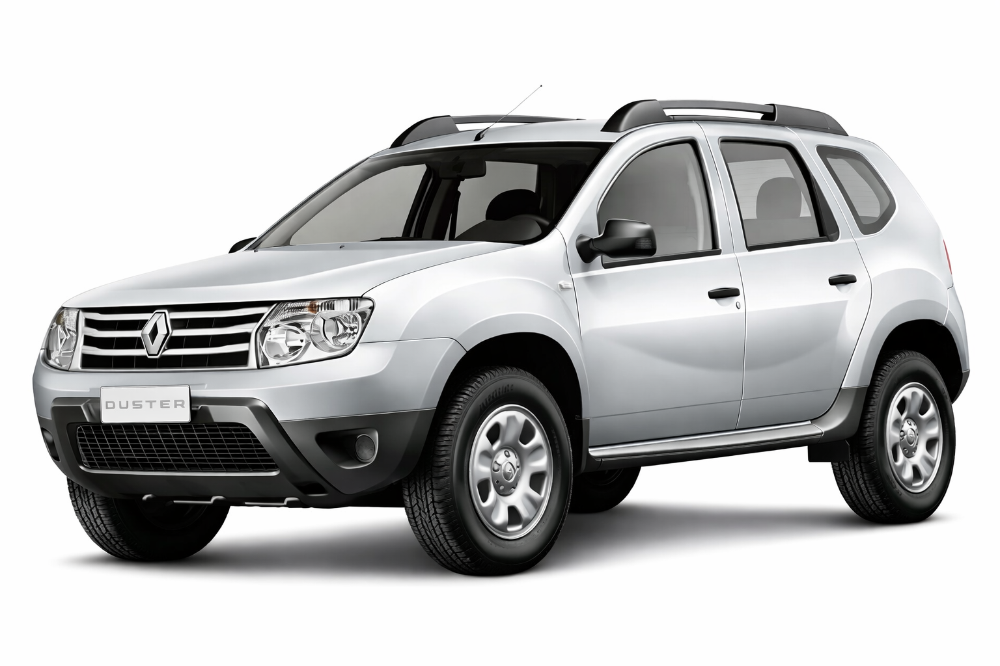

Sitio de referencia con informacion tecnica y mantenimiento esencial.

{fig-alt="Renault Duster vista general"}

## Resumen rapido

- **Vehiculo:** Renault Duster 1.6 16V
- **Anio:** 2015
- **Combustible:** Gasolina (segun version/pais)
- **Tanque:** 50 litros aprox.
- **Intervalo de revision mostrado en tablero:** 10.000 km o 12 meses

## Secciones

- [Ficha tecnica](ficha-tecnica.qmd): motor, dimensiones y capacidades.
- [Mantenimiento](mantenimiento.qmd): checklist y alertas.
- [Niveles y neumaticos](niveles-neumaticos.qmd): controles rutinarios.
- [Fuentes](fuentes.qmd): PDFs usados en `books/`.

::: {.callout-note}
Validar siempre los datos exactos con la etiqueta fisica del vehiculo y el manual asociado al VIN.
:::
