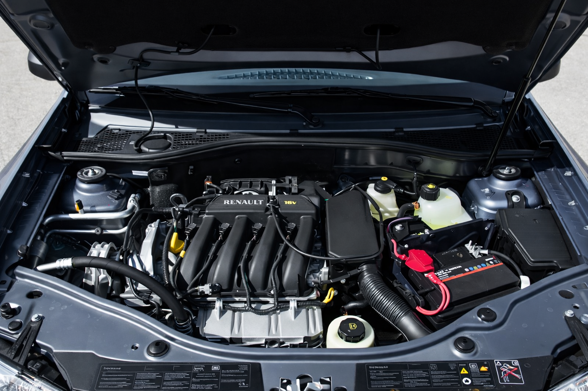

## Intervalo de servicio en tablero

- **Revision:** cada 10.000 km o 12 meses.
- **Aviso previo:** "Prever revision".
- **Aviso final:** "Realizar revision".

## Checklist recomendado

### Cada mes

- Revisar nivel de aceite con varilla (motor frio y superficie horizontal).
- Revisar liquido de frenos y refrigerante.
- Verificar estado de llantas y presion en frio.
- Revisar luces y limpiaparabrisas.

### Cada servicio

- Cambio de aceite y filtro de aceite.
- Inspeccion de frenos, suspension y direccion.
- Revision de filtros (aire, habitaculo y combustible, segun version).
- Registro en justificantes de mantenimiento.

## Alertas practicas del manual

- Si el consumo de aceite supera **0,5 L cada 1.000 km**, consultar taller.
- No superar nivel MAXI de aceite.
- El ventilador puede activarse aun con motor parado.

{fig-alt="Compartimento del motor de la Duster"}
