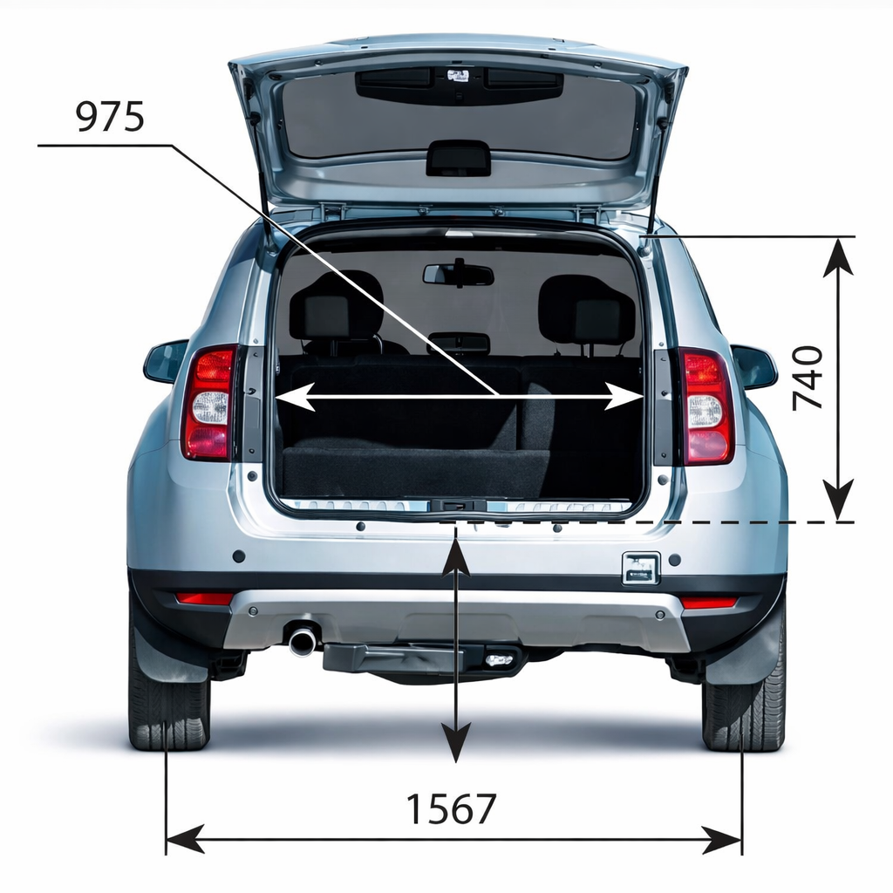
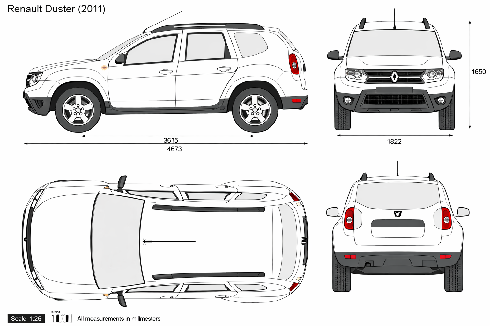

## Niveles del compartimento motor

| Elemento | Como controlarlo | Punto clave |
|---|---|---|
| Aceite de motor | Varilla, motor parado y en plano | Entre MINI y MAXI |
| Liquido de frenos | Deposito en vano motor | No bajar de MINI |
| Refrigerante | Motor frio | Entre MINI y MAXI |
| Lavaparabrisas | Deposito especifico | Usar producto adecuado |

## Neumaticos y presiones

- Medir en frio segun etiqueta (tapa combustible o puerta del conductor).
- Si se mide en caliente, agregar **0,2 a 0,3 bar**.
- No desinflar neumatico caliente.
- En plena carga/remolque: limite 100 km/h y +0,2 bar.
- Usar neumaticos del mismo tipo y medida por eje.

{fig-alt="Vista lateral y referencia de la Duster"}

{fig-alt="Esquema tecnico de carroceria"}
